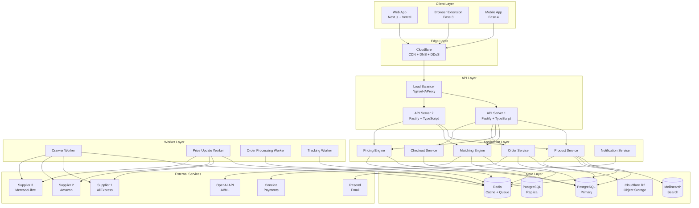
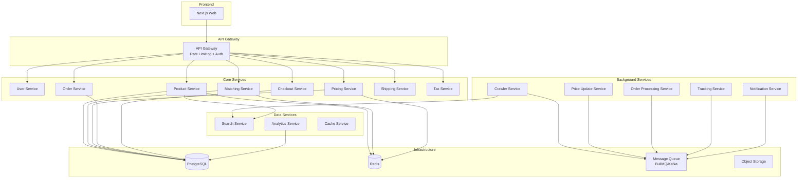
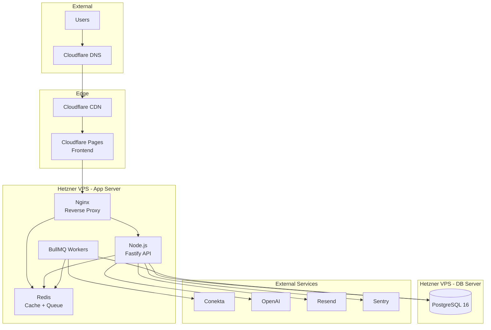
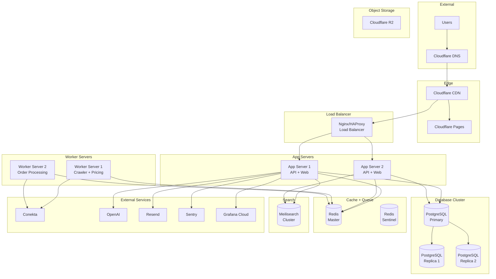
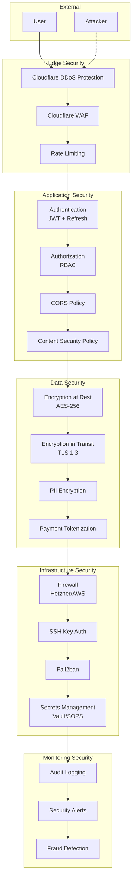
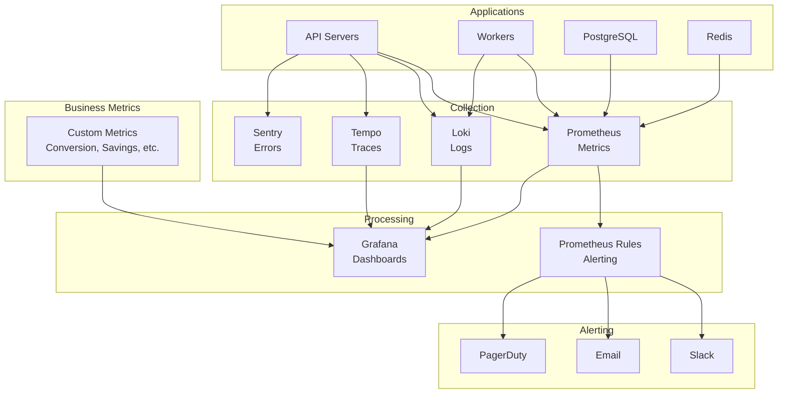
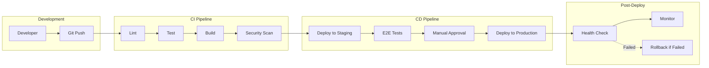

# Architecture Diagrams - PriceHunt

## 1. High-Level Architecture

## 2. Data Flow Architecture

```mermaid
graph LR
    subgraph "Ingestion"
        A[URL/Image/Text] --> B[Product Ingestion]
        B --> C[Normalization]
        C --> D[Storage]
    end

    subgraph "Processing"
        D --> E[Product Matching]
        E --> F[Price Collection]
        F --> G[Price Normalization]
        G --> H[Final Landed Cost]
    end

    subgraph "Ranking"
        H --> I[Supplier Ranking]
        I --> J[Our Pricing Engine]
        J --> K[Best Offer Selection]
    end

    subgraph "Presentation"
        K --> L[Product Page]
        L --> M[Checkout]
        M --> N[Order]
    end

    subgraph "Fulfillment"
        N --> O[Order Routing]
        O --> P[Supplier Purchase]
        P --> Q[Fulfillment]
        Q --> R[Tracking]
        R --> S[Customer]
    end

    style A fill:#e1f5fe
    style S fill:#e8f5e9
    style K fill:#fff3e0
    style M fill:#fce4ec
```

## 3. Microservices Decomposition (Future)

## 4. Infrastructure Topology (MVP)

## 5. Infrastructure Topology (100k Users)

## 6. Security Architecture

## 7. Monitoring Architecture

## 8. CI/CD Pipeline

## Resumen de Capas

| Capa | Tecnología | Propósito |
|------|------------|-----------|
| **Edge** | Cloudflare | CDN, DDoS, DNS, SSL |
| **Frontend** | Next.js (Vercel/Pages) | UI, SSR, SEO |
| **API** | Fastify (Node.js) | REST API |
| **Application** | TypeScript | Business logic |
| **Workers** | BullMQ + Node.js | Background jobs |
| **Database** | PostgreSQL | Persistent storage |
| **Cache** | Redis | Cache + Queue |
| **Search** | Meilisearch | Full-text search |
| **Storage** | Cloudflare R2 | Images, assets |
| **Monitoring** | Sentry + Grafana | Errors + Metrics |
