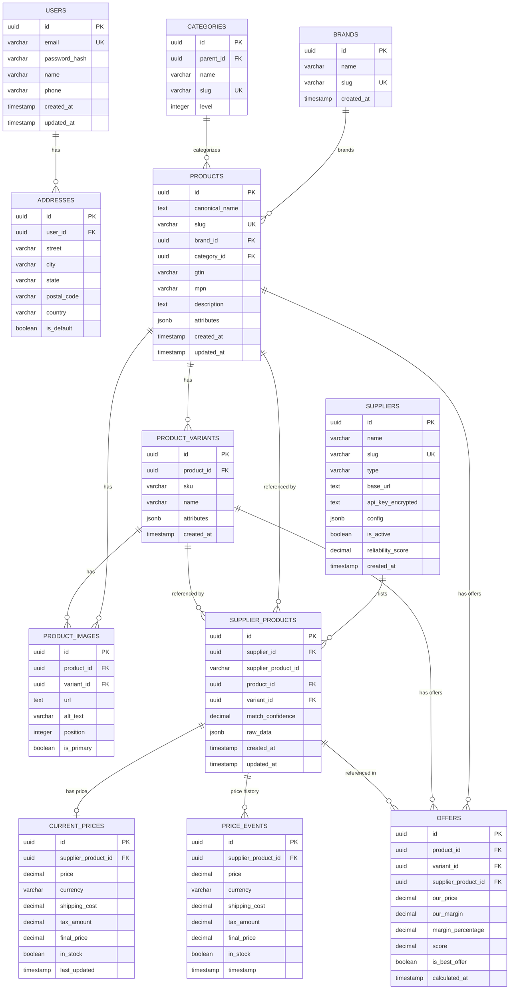
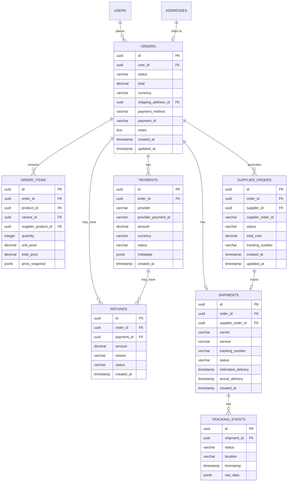
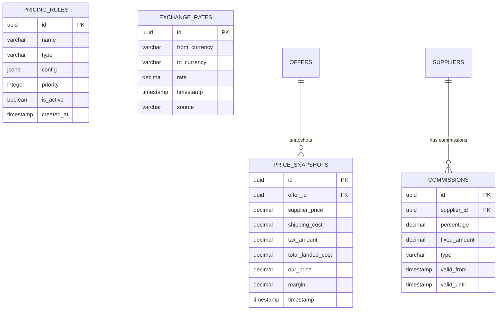
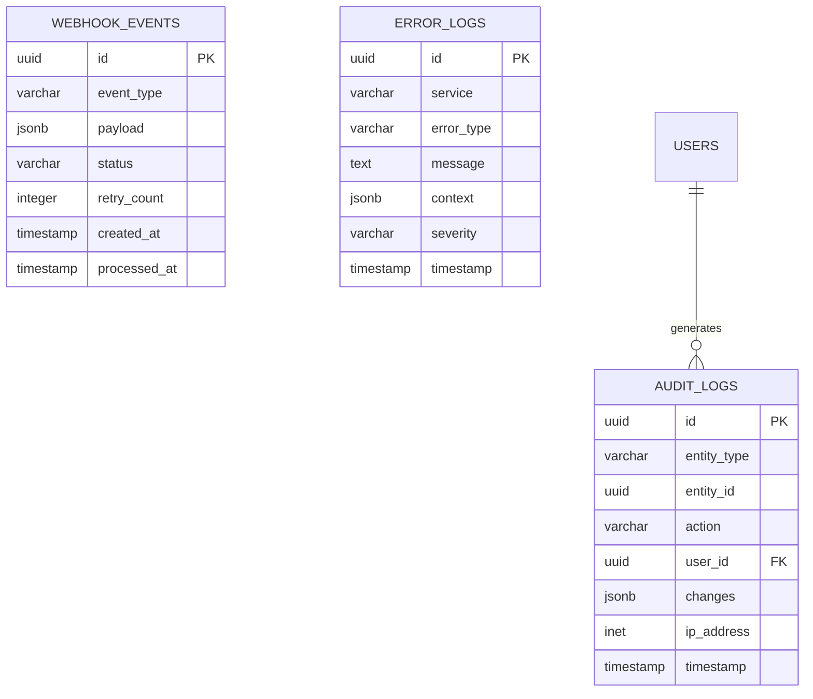
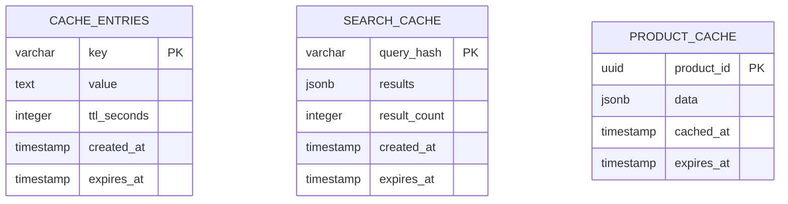

# Entity Relationship Diagrams - PriceHunt

## Diagrama Principal de Entidades

## Diagrama de Órdenes

## Diagrama de Pricing y Reglas

## Diagrama de Auditoría y Logs

## Diagrama de Cache y Sesiones

## Resumen de Relaciones

| Relación | Tipo | Descripción |
|----------|------|-------------|
| Users → Addresses | 1:N | Un usuario tiene muchas direcciones |
| Brands → Products | 1:N | Una marca tiene muchos productos |
| Categories → Products | 1:N | Una categoría tiene muchos productos |
| Products → Variants | 1:N | Un producto tiene muchas variantes |
| Products → Images | 1:N | Un producto tiene muchas imágenes |
| Suppliers → SupplierProducts | 1:N | Un proveedor lista muchos productos |
| Products → SupplierProducts | 1:N | Un producto aparece en muchos proveedores |
| SupplierProducts → CurrentPrices | 1:1 | Cada listing tiene un precio actual |
| SupplierProducts → PriceEvents | 1:N | Historial de precios |
| Products → Offers | 1:N | Ofertas calculadas |
| Orders → OrderItems | 1:N | Una orden tiene muchos items |
| Orders → SupplierOrders | 1:N | Una orden genera órdenes a proveedores |
| Orders → Payments | 1:N | Pagos de una orden |
| Orders → Shipments | 1:1 | Envío de una orden |
| Shipments → TrackingEvents | 1:N | Eventos de tracking |
