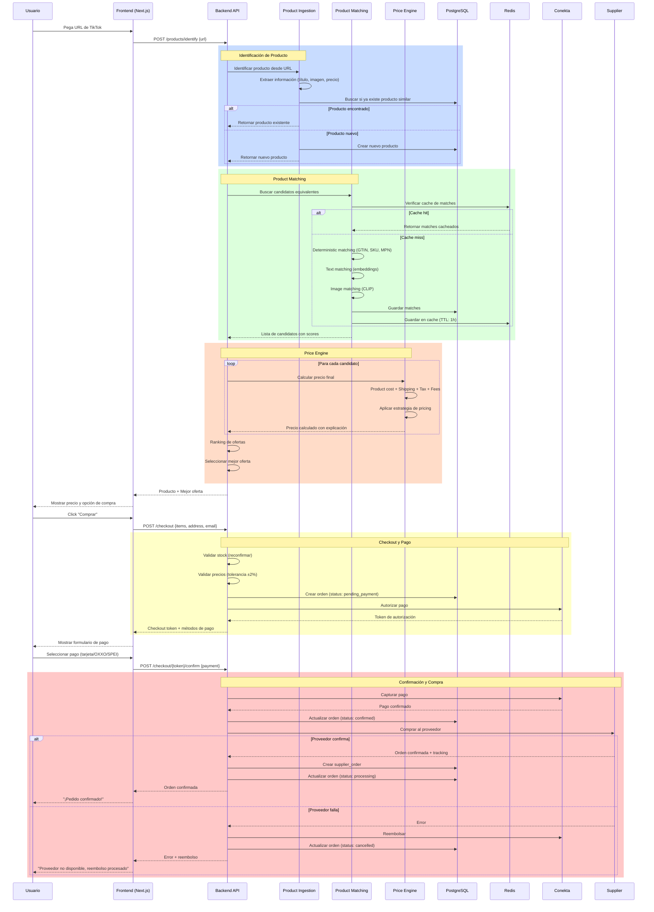
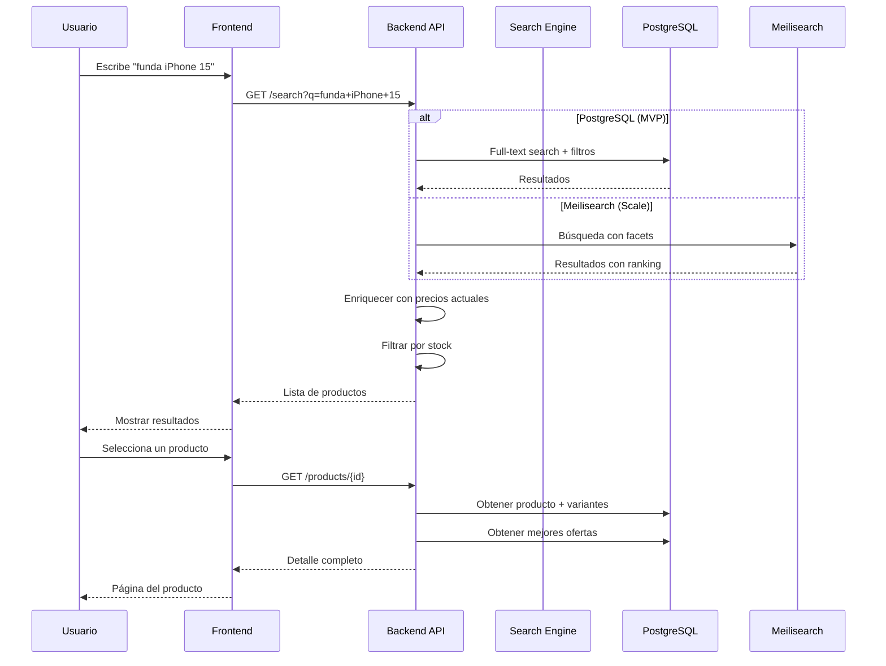
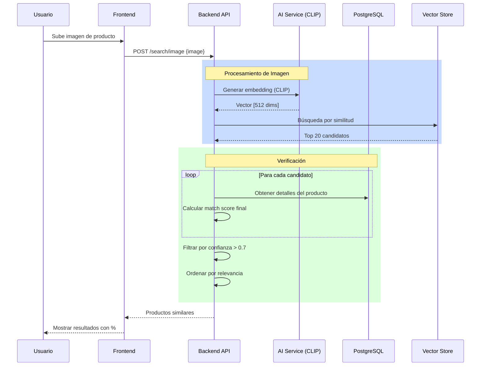
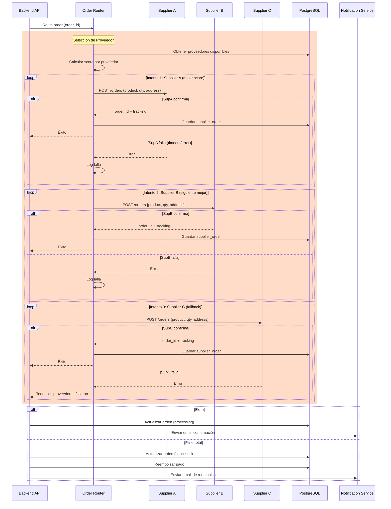
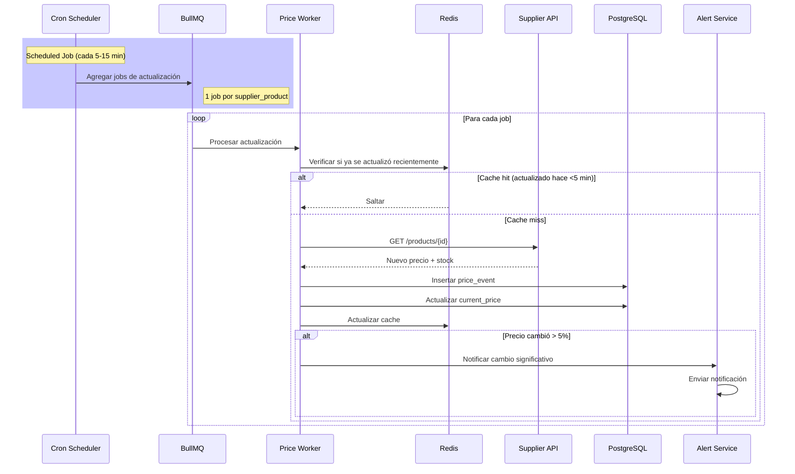
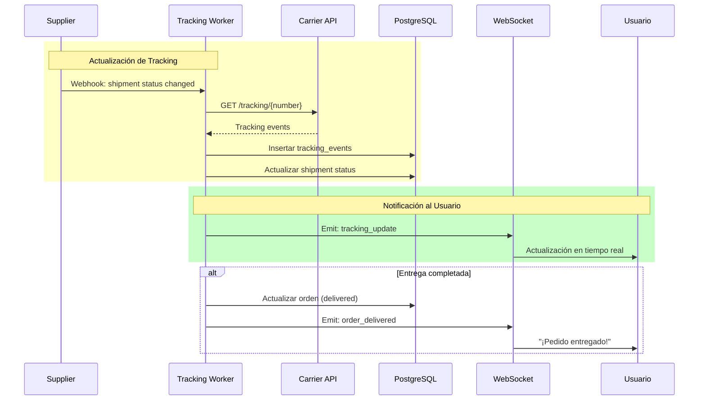
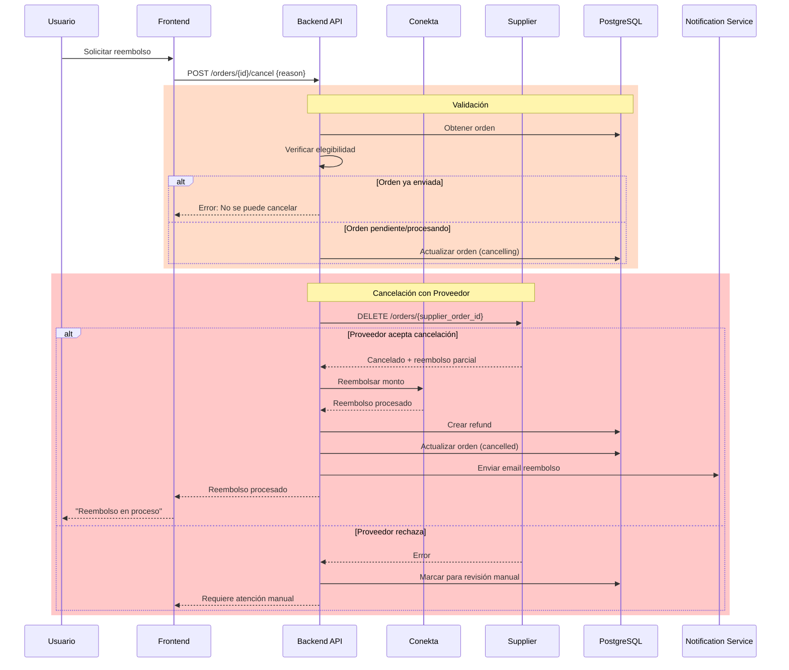
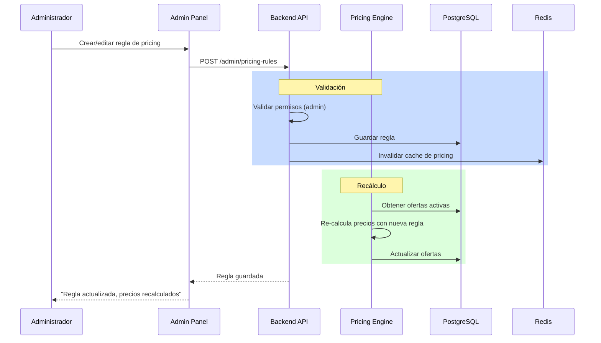

# Sequence Diagrams - PriceHunt

## 1. Flujo Principal: URL → Compra

## 2. Flujo de Búsqueda

## 3. Flujo de Búsqueda por Imagen

## 4. Flujo de Order Routing

## 5. Flujo de Real-Time Pricing

## 6. Flujo de Tracking

## 7. Flujo de Reembolso

## 8. Flujo de Admin: Cambiar Pricing Rule

## Resumen de Flujos

| # | Flujo | Complejidad | Latencia Objetivo |
|---|-------|-------------|-------------------|
| 1 | URL → Compra | Alta | < 5s (identificación + pricing) |
| 2 | Búsqueda | Media | < 500ms |
| 3 | Búsqueda por imagen | Alta | < 2s |
| 4 | Order routing | Alta | < 30s (con fallbacks) |
| 5 | Real-time pricing | Media | Background (5-15 min) |
| 6 | Tracking | Baja | < 1s (webhook) |
| 7 | Reembolso | Media | < 10s |
| 8 | Admin pricing | Baja | < 2s |
